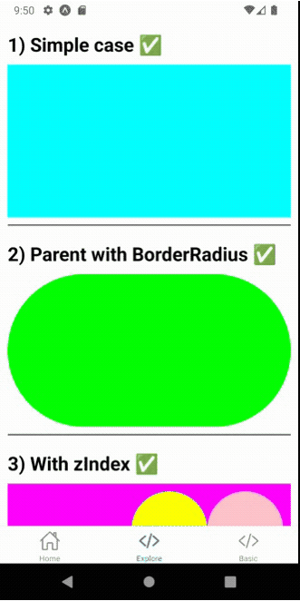
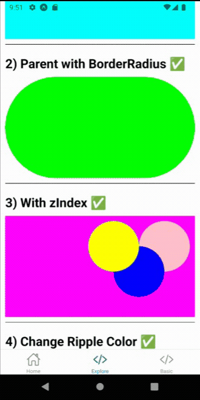
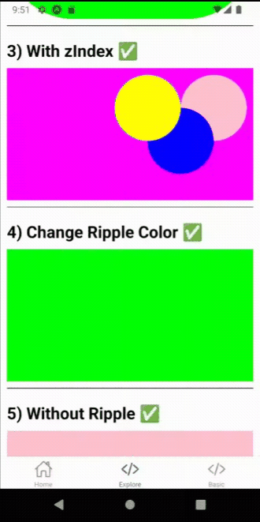
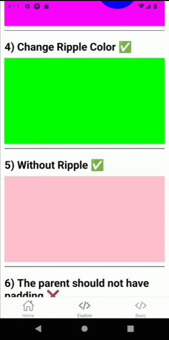
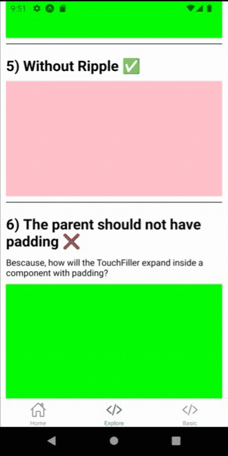
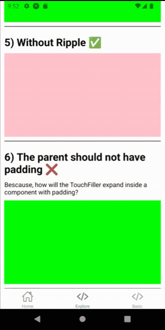

# React Native Touch Filler

A React-Native component that makes a view touchable

# How to use:

<b>

```bash
npm i react-native-touch-filler
```

</b>

# Examples:

## 1) Basic Example:

<b>

```tsx
import React from "react";
import { View } from "react-native";
import TouchFiller from "react-native-touch-filler";

const App = () => {
  return (
    <View
      style={{
        alignSelf: "stretch",
        height: 100,
        backgroundColor: "lime",
        margin: 20,
      }}
    >
      <TouchFiller />
    </View>
  );
};

export default App;
```

</b>

## 2) Full Examples:

Full Example code: https://github.com/OmarThinks/react-native-touch-filler/blob/master/src/ExamplesTouchFiller.tsx

<b>

```tsx
import { ExamplesTouchFiller } from "react-native-touch-filler";

const App = () => {
  return (
    <ExamplesTouchFiller
    // Full Example code: https://github.com/OmarThinks/react-native-touch-filler/blob/master/src/ExamplesTouchFiller.tsx
    />
  );
};

export default App;
```

</b>

### 3) Full Exports

<b>

```tsx
import TouchFiller, { ExamplesTouchFiller } from "react-native-touch-filler";
import type { TouchFillerProps } from "react-native-touch-filler";
```

</b>

# 4) Examples GIFs:













<!--


-->

# Todos:

- Document props
- Examples should contain conent
- Add how to use
- Add table of contents
- Add Why I haven't added a `ref`
- Contributing
